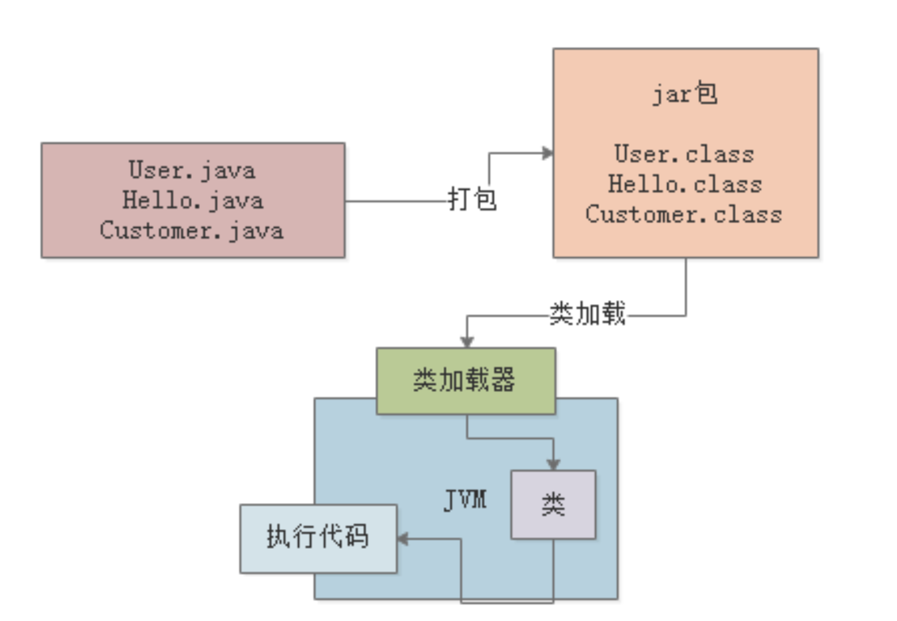

# Java代码如何运行的

首先假设咱们写好了一份Java代码，那这份Java代码中，是不是会包含很多的“.java”为后缀的代码文件？

比如User.java，OrderService.java，CustomerManager.java

其实咱们Java程序员平时在Eclipse、Intellij IDEA等开发工具中，就有很多类似这样的Java源代码文件。

那么大家现在思考一下，当我们写好这些“.java”后缀的代码文件之后，接下来你要部署到线上的机器上去运行，你会怎么做？

一般来说，都是把代码给打成“.jar”后缀的jar包，或者是“.war”后缀的war包，是不是？

然后呢，就是把你打包好的jar包或者是war包给放到线上机器去部署。

这个部署就有很多种途径了，但是最基本的一种方式，就是通过Tomcat这类容器来部署代码，也可以是你自己手动通过“java”命令来运行一个jar包中的代码。

---
但是实际上这里有一个非常关键的步骤，那就是“编译”

也就是说，在我们写好的“.java”代码打包的过程中，一般就会把代码编译成“.class”后缀的字节码文件，比如“User.class”，“Hello.class”，”Customer.class“。

然后这个“.class”后缀的字节码文件，他才是可以被运行起来的！

所以首先，无论大家对JVM机制是否熟悉，咱们都先来回顾一下这个编译的过程，以及“.class”字节码文件的概念。

---
接着我们可能就要思考下一个问题：

对于编译好的这些“.class”字节码，是怎么让他们运行起来的呢？

这个时候就需要使用诸如“java -jar”之类的命令来运行我们写好的代码了。

此时一旦你采用“java”命令，实际上此时就会启动一个JVM进程。

这个JVM就会来负责运行这些“.class”字节码文件，也就相当于是负责运行我们写好的系统。

所以平时我们写好的某个系统在一台机器上部署的时候，你一旦启动这个系统，其实就是启动了一个JVM，由它来负责运行这台机器上运行的这个系统。

---
接着下一步，JVM要运行这些“.class”字节码文件中的代码，那是不是首先得把这些“.class”文件中包含的各种类给加载进来？

这些“.class”文件不就是我们写好的一个一个的类吗？对不对？

此时就会有一个“类加载器”的概念。

此时会采用类加载器把编译好的那些“.class”字节码文件给加载到JVM中，然后供后续代码运行来使用。

---
接着，最后一步，JVM就会基于自己的字节码执行引擎，来执行加载到内存里的我们写好的那些类了

比如你的代码中有一个“main()”方法，那么JVM就会从这个“main()”方法开始执行里面的代码。

他需要哪个类的时候，就会使用类加载器来加载对应的类，反正对应的类就在“.class”文件中。

大家最后看看下面的图。

