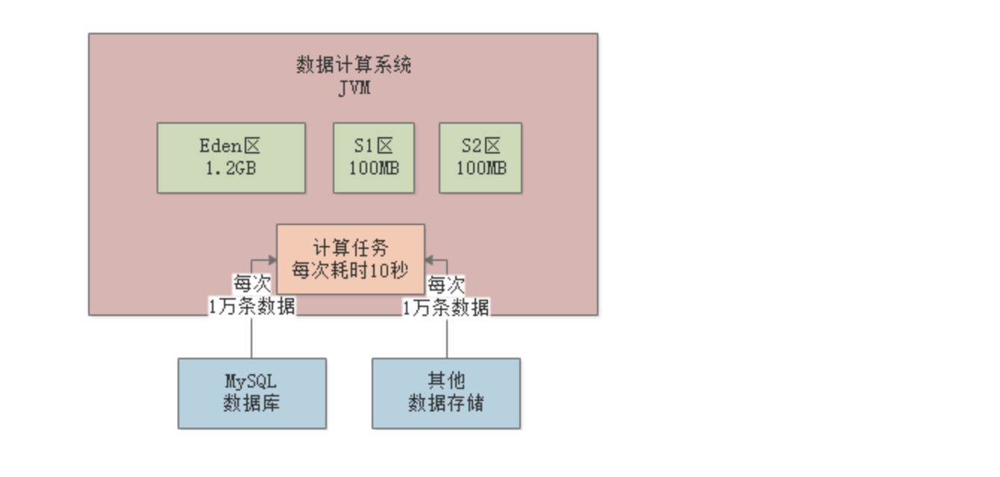

# 系统背景

先给大家说一下这个系统的案例背景，大概来说是当时我们团队里自己研发的一个数据计算系统，日处理数据量在上亿的规模。

为了方便大家集中注意力理解这个系统的生产环境的JVM相关的东西，所以对系统本身就简化说明了。

简单来说，这个系统就是会不停的从MySQL数据库以及其他数据源里提取大量的数据，加载到自己的JVM内存里来进行计算处理，如下图所示。

这个数据计算系统会不停的通过SQL语句和其他方式从各种数据存储中提取数据到内存中来进行计算，大致当时的生产负载是每分钟大概需要执行500次数据提取和计算的任务。

但是这是一套分布式运行的系统，所以生产环境部署了多台机器，每台机器大概每分钟负责执行100次数据提取和计算的任务。

每次会提取大概1万条左右的数据到内存里来计算，平均每次计算大概需要耗费10秒左右的时间

然后每台机器是4核8G的配置，JVM内存给了4G，其中新生代和老年代分别是1.5G的内存空间，大家看下图。

# 这个系统到底多块会塞满新生代？

现在明确了一些核心数据，接着我们来看看这个系统到底多快会塞满新生代的内存空间？

既然这个系统每台机器上部署的实例，每分钟会执行100次数据计算任务，每次是1万条数据需要计算10秒的时间，那么我们来看看每次1万条数据大概会占用多大的内存空间？

这里每条数据都是比较大的，大概每条数据包含了平均20个字段，可以认为平均每条数据在1KB左右的大小。那么每次计算任务的1万条数据就对应了10MB的大小。

所以大家此时可以思考一下，如果新生代是按照8:1:1的比例来分配Eden和两块Survivor的区域，那么大体上来说，Eden区就是1.2GB，每块Survivor区域在100MB左右

基本上按照这个内存大小而言，大家会发现，每次执行一个计算任务，就会在Eden区里分配10MB左右的对象，那么一分钟大概对应100次计算任务

其实基本上一分钟过后，Eden区里就全是对象，基本就全满了。

所以说，回答这个小节的问题，新生代里的Eden区，基本上1分钟左右就迅速填满了。

# 触发Minor GC的时候会有多少对象进入老年代？

此时假设新生代的Eden区在1分钟过后都塞满对象了，然后在接着继续执行计算任务的时候，势必会导致需要进行Minor GC回收一部分的垃圾对象。

那么上篇文章给大家讲过这里在执行Minor GC之前会先进行的检查。

首先第一步，先看看老年代的可用内存空间是否大于新生代全部对象？

看下图，此时老年代是空的，大概有1.5G的可用内存空间，新生代的Eden区大概算他有1.2G的对象好了。

此时会发现老年代的可用内存空间有1.5GB，新生代的对象总共有1.2GB，即使一次Minor GC过后，全部对象都存活，老年代也能放的下的，那么此时就会直接执行Minor GC了。

那么此时Eden区里有多少对象还是存活的，无法被垃圾回收呢？

大家可以考虑一下之前说的那个点，每个计算任务1万条数据需要计算10秒钟，假设此时80个计算任务都执行结束了，但是还有20个计算任务共计200MB的数据还在计算中，此时就是200MB的对象是存活的，不能被垃圾回收掉，然后有1GB的对象是可以垃圾回收的

此时一次Minor GC就会回收掉1GB的对象，然后200MB的对象能放入Survivor区吗？

不能！因为任何一块Survivor区实际上就100MB的空间，此时就会通过空间担保机制，让这200MB对象直接进入老年代去，占用里面200MB内存空间，然后Eden区就清空了

# 系统运行多久，老年代大概就会填满？

那么大家想一下，这个系统大概运行多久，老年代会填满呢？

按照上述计算，每分钟都是一个轮回，大概算下来是每分钟都会把新生代的Eden区填满，然后触发一次Minor GC，然后大概都会有200MB左右的数据进入老年代。

那么大家可以想一下，假设现在2分钟运行过去了，此时老年代已经有400MB内存被占用了，只有1.1GB的内存可用，此时如果第3分钟运行完毕，又要进行Minor GC，会做什么检查呢？如下图。

此时会先检查老年代可用空间是否大于新生代全部对象？

此时老年代可用空间1.1GB，新生代对象有1.2GB，那么此时假设一次Minor GC过后新生代对象全部存活，老年代是放不下的，那么此时就得看看一个参数是否打开了 。

如果“-XX:-HandlePromotionFailure”参数被打开了，当然一般都会打开，此时会进入第二步检查，就是看看老年代可用空间是否大于历次Minor GC过后进入老年代的对象的平均大小。

我们已经计算过了，大概每分钟会执行一次Minor GC，每次大概200MB对象会进入老年代。

那么此时发现老年代的1.1GB空间，是大于每次Minor GC后平均200MB对象进入老年代的大小的

所以基本可以推测，本次Minor GC后大概率还是有200MB对象进入老年代，1.1G可用空间是足够的。

所以此时就会放心执行一次Minor GC，然后又是200MB对象进入老年代。

转折点大概在运行了7分钟过后，7次Minor GC执行过后，大概1.4G对象进入老年代，老年代剩余空间就不到100MB了，几乎快满了

# 这个系统运行多久，老年代会触发1次Full GC？

大概在第8分钟运行结束的时候，新生代又满了，执行Minor GC之前进行检查，此时发现老年代只有100MB内存空间了，比之前每次Minor GC后进入老年代的200MB对象要小，此时就会直接触发一次Full GC。

Full GC会把老年代的垃圾对象都给回收了，假设此时老年代被占据的1.4G空间里，全部都是可以回收的对象，那么此时一次性就会把这些对象都给回收了，如下图。

然后接着就会执行Minor GC，此时Eden区情况，200MB对象再次进入老年代，之前的Full GC就是为这些新生代本次Minor GC要进入老年代的对象准备的，如下图。

按照这个运行模型，基本上平均就是七八分钟一次Full GC，这个频率就相当高了。因为每次Full GC速度都是很慢的，性能很差，而且明天的文章会告诉大家，为什么Full GC的时候会严重影响系统性能。

